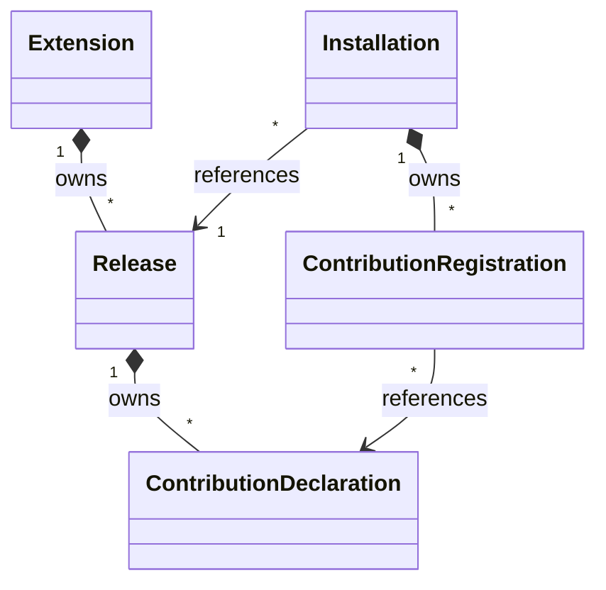

# Extension control model

The [ESS domain](../ess/domains/extensions.yaml) declares five control records and five explicit
relations. The [component](../ess/components/extensions.yaml) owns that domain.

## Ownership and cardinality

| Source | Relation | Target | Cardinality from source | Carrier |
|---|---|---|---|---|
| Extension | owns releases | Release | many | Release.extension_id |
| Release | owns contributions | ContributionDeclaration | many | ContributionDeclaration.release_id |
| Installation | references release | Release | one | Installation.release_id |
| Installation | owns registrations | ContributionRegistration | many | ContributionRegistration.installation_id |
| ContributionRegistration | references declaration | ContributionDeclaration | one | ContributionRegistration.contribution_id |

A release belongs to an extension independently of any installation. Multiple installations may
reference the same release. Removing an installation therefore cannot imply deleting that release.
Registration records belong to an installation; the declaration they reference remains release-owned.

ESS checks the declared targets, carrier types and ownership graph. An `owns` relation expresses
dependent identity; it does not select cascade deletion or permission to destroy data. Removal,
retention and dependency refusal still need command outcomes.

## Structural modeling choices

- Logical identities are distinct opaque String newtypes. This separates an extension, release,
  installation, declaration and registration without assuming UUID allocation or deriving identity
  from a Git repository name.
- Artifact references carry a location and SHA-256 field. This preserves the need for exact
  artifact references; the draft schema does not yet enforce canonical location or digest syntax.
- Contribution categories are Domain, Ui, Connector, Agent, Workflow, Background and Policy.
  Concrete definitions remain in the contracts of their owning runtimes.
- An installation carries a typed tenant reference and a human-facing name. Tenant is a persisted
  fact from verified authentication, not a caller-controlled operation selector.
- Every entity has one terminal `Recorded` state and no commands. This deliberately models
  structural snapshots. `Recorded` means neither enabled nor active; an operational lifecycle
  must arrive together with the commands and events that cause its transitions.

There is no independently owned Tenant, Agent, WorkflowRun, Connection, Grant, credential or
business-data entity here. The control service retains references to foundation-owned resources
through contracts that must still be resolved.

## Configuration and installation policy proposal

This pass gives configuration and policy typed values within the existing owners. It remains a
draft: the following admission requirements are proposed semantics, not running commands.
Configuration snapshots, origins, policies and membership are value objects, not new independently
owned entities. The five relations above therefore remain unchanged.

### Configuration

A release declares a `ConfigurationContract`: the supported `JsonSchema202012` dialect and an
exact schema artifact reference. Even a release with no settings declares an empty-object schema.
Admission must verify the schema artifact and its entire reference closure before validating a
document; it must not fetch arbitrary references during a configuration update. Unsupported
dialects, unresolved references and invalid documents are refusals.

An installation holds a `ConfigurationSnapshot` with a positive, monotonically increasing revision,
an immutable document key and its SHA-256. The document belongs to that installation's namespace.
A key is an opaque storage selector, not a URL, path traversal instruction or credential. Equal
keys in two installations select different documents; authorization precedes lookup. Foundation
credential values remain in their existing custody service. A configuration document can refer
to a separately authorized binding, whose contract remains to be specified.

The selected release supplies the configuration schema. A successful update validates the complete
resulting document and atomically replaces the snapshot using its expected revision; a stale
revision is refused. Failed validation leaves the current document and revision unchanged.
Retries return the prior outcome. Storage layout and causal update commands remain `UNMAPPED:`.

Upgrades preserve explicitly configured values. Defaults apply only to missing values and never
overwrite an explicit value. A candidate release and its migrated configuration are validated
before switching the release and configuration references together. An incompatible value requires
an explicit migration; failure preserves the current pair. Removing a control installation does
not destroy its retained configuration or domain data. Their retention/destruction contracts are
a later model pass.

### Locks and editable settings

`InstallationPolicy` is shared by a release's technical constraints and deployment policy.
`InstallationLocks` has four independent Boolean fields: `version_updates`, `enable_disable`,
`removal` and `configuration`. True prohibits the respective operation. A fully frozen
installation sets all four. Preinstallation alone does not imply a lock.

Resolve every operation against current applicable policy, with these rules:

| Policy part | Resolution |
|---|---|
| Each lock | Logical OR across release constraints and deployment policy |
| Editable settings | Exact intersection of both lists; an empty list grants no exception |
| Count limits | Minimum of applicable maxima within each scope; both scopes must admit |

An editable setting is a canonical JSON Pointer naming one complete setting. It is an exception
only to the configuration lock, and grants no action authority. A schema-valid change still
requires ordinary caller authorization. When configuration is unlocked, schema-valid settings
can change without appearing in the exception list.

When configuration is locked, every changed setting must match the effective exception list.
There is no wildcard, prefix matching or implicit parent permission. A setting may be a scalar,
object or array; selecting an object/array permits replacement of that entire setting. Admission
must reject overlapping ancestor/descendant declarations and pointers that do not resolve to a
setting in the release's configuration contract. Root-document exceptions are refused. Arrays
are whole settings, so reordering cannot transfer an exception to another element.

For example, both layers allowing `/display_name` permits changing that value on a frozen Phone
installation. It does not permit changing `/provider`, enabling the installation or changing its
release. Defaults, deletion and migration are evaluated by their complete resulting document;
they cannot smuggle a change outside the allowed settings. An absent setting may be created only
if the schema defines it and the same path is allowed. Canonical path parsing, declared setting
boundaries and evaluation of the changed-setting set remain `UNMAPPED:`.

`PolicySnapshot` records the effective rules and an opaque revision of their inputs for evidence.
It is not a grant or the source of future authority. Admission must reject/retry when source
policy or the installation revision changes concurrently. A user configuration update cannot
change policy, origin, deployment identity or membership. Trusted policy administration is a
separate authority; a deployment cannot relax release constraints.

### Preinstallation and admission identity

`InstallationOrigin` is a tagged union: `requested` carries an `AdmissionKey`, and `preinstalled`
carries a `PreinstallationKey`. Generated JSON uses `{"kind":"preinstalled","value":"east-phone"}`.

Deployment tooling supplies a stable declaration key. The tuple (deployment, tenant, extension,
preinstallation key) identifies the desired instance across reconciliation, restart and release
updates. Renaming a display name does not create another instance. A matching key resolves to the
existing installation and consumes no additional capacity; different desired settings or releases
go through the ordinary locked update path. A removed preinstallation is not silently resurrected:
recreation requires explicit new installation intent and fresh admission. Removing a deployment
declaration is not itself permission to remove the installation.

Requested admission keys are bound to authenticated tenant, actor and exact optional realm before
idempotency lookup. A retry with the same key and original request returns the recorded outcome;
reusing it for different intent is a conflict. Neither a retry nor a preinstallation lookup
bypasses authorization. The authenticated key encoding and tombstone lifetime remain `UNMAPPED:`.

`deployment_id` is a trusted bootstrap fact; `tenant_id` remains a verified authentication fact.
Neither becomes an application operation selector. External deployment/tenant reference owners
and retirement behavior require their public contracts; Extensions does not own either entity.

### Count membership and concurrent admission

Every count is per stable extension identity, across releases. The Tenant bucket is (tenant,
extension); the Deployment bucket is (deployment, extension) across tenants. Within the control
authority, a Tenant bucket includes that tenant's installations in all managed deployments.
Federated control authorities and cross-authority quota ownership remain `UNMAPPED:`.

A limit's maximum is a nonnegative integer. Zero refuses new admissions. An absent entry adds no
restriction at that policy layer; duplicate scope entries normalize to their minimum. The
effective Tenant and Deployment restrictions both apply. Lowering a limit below existing usage
does not evict installations: usage remains visible and additional admissions are refused until
they fit. No-op retries, updates and upgrades do not allocate a new slot.

`CountMembership` is explicit bookkeeping independent of operational readiness:

| Condition | Membership / admission effect |
|---|---|
| Request refused before durable admission | No installation or reservation committed |
| Admitted, validation/provisioning/activation pending | Held |
| Activation failed, including partial registration | Held |
| Active or disabled | Held |
| Removal or cancellation awaiting cleanup confirmation | Held |
| Confirmed removed/cancelled, with retained data | Released |

These conditions are requirements for the later lifecycle; `Recorded` is still the only ESS
entity state. A client cannot write membership, and a timeout does not release it. A preinstalled
instance follows exactly the same rules. Held includes the reservation: activation never adds a
second count. Released records and retained domain/configuration data consume no slot.

Admission must serialize the unique installation/admission identity and capacity check across
all applicable buckets. It commits the installation with Held membership and all reservations
atomically, or commits none. Counting with an eventually consistent list is insufficient. A crash
after commit must be distinguishable from refusal before commit using the durable retry identity.
Release of capacity is also idempotent and happens only after required cleanup is confirmed.
The persistence transaction/serialization mechanism, reservation representation, reconciliation
and causal removal commands remain `UNMAPPED:`; no in-memory counter is claimed as enforcement.

Release technical limits govern requests selecting that release; deployment limits are the
persistent fleet-wide ceiling. Both count all releases. Selecting a more permissive release does
not override deployment policy. Upgrades re-evaluate target compatibility and policy without
counting the installation twice; behavior when a target's technical ceiling is below existing
usage must be settled with the upgrade command before it can activate.

### Validation boundary

The gate validates the ESS model and generated schemas, and checks the examples in
`fixtures/schema-cases.json` against those actual projections using a JSON Schema validator with
HTTP/file retrieval disabled. Refusals cover missing configuration, unsupported dialects, mixed
origin forms, incomplete/string-valued locks, unknown scopes and non-integer limits. Two
installations with the same document key are structurally valid; that does not prove storage
isolation.

ESS 0.9.2 publishes `ConfigurationRevision > 0` and `InstallationCount >= 0` predicates as
`x-ess-invariants` annotations. Standard JSON Schema therefore accepts revision zero and negative
integer counts. The gate checks both annotations and this known gap so it cannot accidentally
claim numeric admission. Runtime admission must evaluate those predicates in addition to schema
validation. It must also validate digests, paths, schema contents, locks, policy intersection,
identity consistency, authorization and concurrency. Those are not established by these fixtures.

The new required fields revise the unreleased structural draft. Existing baseline documents need
explicit backfill; they must not gain guessed deployment identity, configuration or policy defaults.
A future released contract requires its own versioned migration.

## Unresolved semantics

These `UNMAPPED:` items are present beside the relevant ESS declarations. Their resolution is
required before implementation work that relies on them.

| Item | What must settle it |
|---|---|
| Identifier allocation and canonical spelling | Public API identity contract; no repository-name or realm-derived shortcut |
| Artifact integrity and runtime compatibility | Typed location/digest rules and admission against supported runtime capabilities |
| External tenant relation | Identity's public reference contract and tenant-retirement consequences |
| Configuration admission | Schema closure, digest/path parsers, setting boundaries, optimistic updates and migration commands |
| Policy and count enforcement | Source revisions, authenticated retry-key encoding, atomic bucket reservations and cleanup confirmation |
| External deployment relation | Trusted bootstrap reference contract and retirement behavior |
| Resource bindings | Typed foundation/installation target selection, compatibility and caller authority |
| Registration consistency | A command must enforce that a declaration belongs to the installation's selected release |
| Runtime resource references | Owner contracts must establish cardinality and distinguish control references from resource ownership |
| Activation and recovery | Durable progress, stable retry identities, readiness, partial registration, compensation and causal transitions |
| Upgrade, removal and retention | Provenance, configuration preservation, dependency refusal and separate data destruction |

The compiler's structural validation does not enforce cross-record release consistency, tenant
name uniqueness, resource authorization, quota concurrency or runtime readiness. Generated schemas
are projections of this structural subset. No passing structural check is evidence that the
[operational scenarios](scenarios.md) pass.

## Foundation and host boundaries

ESS owns semantic compilation and projection. Platform SDK supplies authoring contracts, builders,
clients and runtime/host adapters. Extensions coordinates installation and registration.
Foundation services retain their own execution and authoritative state.

Workspace owns project and repository working context; Substrate executes admitted work.
Agent Platform and Workflow own their definitions and runs. Connectors retains provider
authorization, Connections and grants; existing custody integrations hold credential values.
Installation selection supplements authenticated tenant, actor and exact optional realm.

A host places panels and attaches them to application sessions. Moving a Phone panel must preserve
its call session unless that extension explicitly declares different behavior. Domain services
retain business data independently of panel or installation-control lifetimes.
