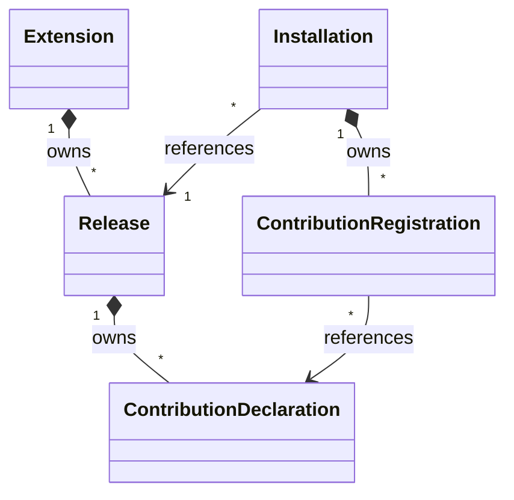

# Extension control model

The [ESS domain](../ess/domains/extensions.yaml) declares five control records and five explicit
relations. The [component](../ess/components/extensions.yaml) owns that domain.



## Ownership and cardinality

| Source | Relation | Target | Cardinality from source | Carrier |
|---|---|---|---|---|
| Extension | owns releases | Release | many | Release.extension_id |
| Release | owns contributions | ContributionDeclaration | many | ContributionDeclaration.release_id |
| Installation | references release | Release | one | Installation.release_id |
| Installation | owns registrations | ContributionRegistration | many | ContributionRegistration.installation_id |
| ContributionRegistration | references declaration | ContributionDeclaration | one | ContributionRegistration.contribution_id |

A release belongs to an extension independently of any installation. Multiple installations may
reference the same release. Removing an installation therefore cannot imply deleting that release.
Registration records belong to an installation; the declaration they reference remains release-owned.

ESS checks the declared targets, carrier types and ownership graph. An `owns` relation expresses
dependent identity; it does not select cascade deletion or permission to destroy data. Removal,
retention and dependency refusal have draft command outcomes below; persistence remains unimplemented.

## Structural modeling choices

- Logical identities are distinct opaque String newtypes. This separates an extension, release,
  installation, declaration and registration without assuming UUID allocation or deriving identity
  from a Git repository name.
- Artifact references carry a location and SHA-256 field. This preserves the need for exact
  artifact references; the draft schema does not yet enforce canonical location or digest syntax.
- Contribution categories are Domain, Ui, Connector, Agent, Workflow, Background and Policy.
  Concrete definitions remain in the contracts of their owning runtimes.
- An installation carries a typed tenant reference and a human-facing name. Tenant is a persisted
  fact from verified authentication, not a caller-controlled operation selector.
- Extension, Release and ContributionDeclaration retain their immutable `Recorded` lifecycle.
  Installation and ContributionRegistration have the eighteen causal commands described below.
  `Recorded` means admitted control data exists; it does not mean active or registered.

There is no independently owned Tenant, Agent, WorkflowRun, Connection, Grant, credential or
business-data entity here. The control service retains references to foundation-owned resources
through contracts that must still be resolved.

## Configuration and installation policy proposal

This pass gives configuration and policy typed values within the existing owners. It remains a
draft: the following admission requirements are proposed semantics, not running commands.
Configuration snapshots, origins, policies and membership are value objects, not new independently
owned entities. The five relations above therefore remain unchanged.

### Configuration

A release declares a `ConfigurationContract`: the supported `JsonSchema202012` dialect and an
exact schema artifact reference. Even a release with no settings declares an empty-object schema.
Admission must verify the schema artifact and its entire reference closure before validating a
document; it must not fetch arbitrary references during a configuration update. Unsupported
dialects, unresolved references and invalid documents are refusals.

An installation holds a `ConfigurationSnapshot` with a positive, monotonically increasing revision,
an immutable document key and its SHA-256. The document belongs to that installation's namespace.
A key is an opaque storage selector, not a URL, path traversal instruction or credential. Equal
keys in two installations select different documents; authorization precedes lookup. Foundation
credential values remain in their existing custody service. A configuration document can refer
to a separately authorized binding through the typed selection below.

The selected release supplies the configuration schema. A successful update validates the complete
resulting document and atomically replaces the snapshot using its expected revision; a stale
revision is refused. Failed validation leaves the current document and revision unchanged.
Retries return the prior outcome. Storage layout and causal update commands remain `UNMAPPED:`.

Upgrades preserve explicitly configured values. Defaults apply only to missing values and never
overwrite an explicit value. A candidate release and its migrated configuration are validated
before switching the release and configuration references together. An incompatible value requires
an explicit migration; failure preserves the current pair. Removing a control installation does
not destroy its retained configuration or domain data. The explicit retention and separate destruction contracts are declared below.

### Locks and editable settings

`InstallationPolicy` is shared by a release's technical constraints and deployment policy.
`InstallationLocks` has four independent Boolean fields: `version_updates`, `enable_disable`,
`removal` and `configuration`. True prohibits the respective operation. A fully frozen
installation sets all four. Preinstallation alone does not imply a lock.

Resolve every operation against current applicable policy, with these rules:

| Policy part | Resolution |
|---|---|
| Each lock | Logical OR across release constraints and deployment policy |
| Editable settings | Exact intersection of both lists; an empty list grants no exception |
| Count limits | Minimum of applicable maxima within each scope; both scopes must admit |

An editable setting is a canonical JSON Pointer naming one complete setting. It is an exception
only to the configuration lock, and grants no action authority. A schema-valid change still
requires ordinary caller authorization. When configuration is unlocked, schema-valid settings
can change without appearing in the exception list.

When configuration is locked, every changed setting must match the effective exception list.
There is no wildcard, prefix matching or implicit parent permission. A setting may be a scalar,
object or array; selecting an object/array permits replacement of that entire setting. Admission
must reject overlapping ancestor/descendant declarations and pointers that do not resolve to a
setting in the release's configuration contract. Root-document exceptions are refused. Arrays
are whole settings, so reordering cannot transfer an exception to another element.

For example, both layers allowing `/display_name` permits changing that value on a frozen Phone
installation. It does not permit changing `/provider`, enabling the installation or changing its
release. Defaults, deletion and migration are evaluated by their complete resulting document;
they cannot smuggle a change outside the allowed settings. An absent setting may be created only
if the schema defines it and the same path is allowed. Canonical path parsing, declared setting
boundaries and evaluation of the changed-setting set remain `UNMAPPED:`.

`PolicySnapshot` records the effective rules and an opaque revision of their inputs for evidence.
It is not a grant or the source of future authority. Admission must reject/retry when source
policy or the installation revision changes concurrently. A user configuration update cannot
change policy, origin, deployment identity or membership. Trusted policy administration is a
separate authority; a deployment cannot relax release constraints.

### Preinstallation and admission identity

`InstallationOrigin` is a tagged union: `requested` carries an `AdmissionKey`, and `preinstalled`
carries a `PreinstallationKey`. Generated JSON uses `{"kind":"preinstalled","value":"east-phone"}`.

Deployment tooling supplies a stable declaration key. The tuple (deployment, tenant, extension,
preinstallation key) identifies the desired instance across reconciliation, restart and release
updates. Renaming a display name does not create another instance. A matching key resolves to the
existing installation and consumes no additional capacity; different desired settings or releases
go through the ordinary locked update path. A removed preinstallation is not silently resurrected:
recreation requires explicit new installation intent and fresh admission. Removing a deployment
declaration is not itself permission to remove the installation.

Requested admission keys are bound to authenticated tenant, actor and exact optional realm before
idempotency lookup. A retry with the same key and original request returns the recorded outcome;
reusing it for different intent is a conflict. Neither a retry nor a preinstallation lookup
bypasses authorization. The authenticated key encoding and tombstone lifetime remain `UNMAPPED:`.

`deployment_id` is a trusted bootstrap fact; `tenant_id` remains a verified authentication fact.
Neither becomes an application operation selector. External deployment/tenant reference owners
and retirement behavior require their public contracts; Extensions does not own either entity.

### Count membership and concurrent admission

Every count is per stable extension identity, across releases. The Tenant bucket is (tenant,
extension); the Deployment bucket is (deployment, extension) across tenants. Within the control
authority, a Tenant bucket includes that tenant's installations in all managed deployments.
Federated control authorities and cross-authority quota ownership remain `UNMAPPED:`.

A limit's maximum is a nonnegative integer. Zero refuses new admissions. An absent entry adds no
restriction at that policy layer; duplicate scope entries normalize to their minimum. The
effective Tenant and Deployment restrictions both apply. Lowering a limit below existing usage
does not evict installations: usage remains visible and additional admissions are refused until
they fit. No-op retries, updates and upgrades do not allocate a new slot.

`CountMembership` is explicit bookkeeping independent of operational readiness:

| Condition | Membership / admission effect |
|---|---|
| Request refused before durable admission | No installation or reservation committed |
| Admitted, validation/provisioning/activation pending | Held |
| Activation failed, including partial registration | Held |
| Active or disabled | Held |
| Removal or cancellation awaiting cleanup confirmation | Held |
| Confirmed removed/cancelled, with retained data | Released |

Activation and removal now have declared causal states below. Disabled and cancelled remain
requirements for a later lifecycle pass. A client cannot write membership, and a timeout does not release it. A preinstalled
instance follows exactly the same rules. Held includes the reservation: activation never adds a
second count. Released records and retained domain/configuration data consume no slot.

Admission must serialize the unique installation/admission identity and capacity check across
all applicable buckets. It commits the installation with Held membership and all reservations
atomically, or commits none. Counting with an eventually consistent list is insufficient. A crash
after commit must be distinguishable from refusal before commit using the durable retry identity.
Release of capacity is also idempotent and happens only after required cleanup is confirmed.
The persistence transaction/serialization mechanism, reservation representation, reconciliation
and enforcement of the causal removal commands remain `UNMAPPED:`; no in-memory counter is claimed as enforcement.

Release technical limits govern requests selecting that release; deployment limits are the
persistent fleet-wide ceiling. Both count all releases. Selecting a more permissive release does
not override deployment policy. Upgrades re-evaluate target compatibility and policy without
counting the installation twice; behavior when a target's technical ceiling is below existing
usage is a refusal of the upgrade under the draft admission rule below.

### Validation boundary

The gate validates the ESS model and generated schemas, and checks the examples in
`fixtures/schema-cases.json` against those actual projections using a JSON Schema validator with
HTTP/file retrieval disabled. Refusals cover missing configuration, unsupported dialects, mixed
origin forms, incomplete/string-valued locks, unknown scopes and non-integer limits. Two
installations with the same document key are structurally valid; that does not prove storage
isolation.

ESS 0.9.2 publishes `ConfigurationRevision > 0`, `InstallationCount >= 0`, `BindingRevision > 0`,
`ReconciliationGeneration > 0` and `RetryAttempt > 0` predicates as `x-ess-invariants` annotations.
Standard JSON Schema therefore accepts zero for those positive counters and negative integer counts. The gate checks both annotations and this known gap so it cannot accidentally
claim numeric admission. Runtime admission must evaluate those predicates in addition to schema
validation. It must also validate digests, paths, schema contents, locks, policy intersection,
identity consistency, authorization and concurrency. Those are not established by these fixtures.

The new required fields revise the unreleased structural draft. Existing baseline documents need
explicit backfill; they must not gain guessed deployment identity, configuration or policy defaults.
A future released contract requires its own versioned migration.

## Binding and activation proposal

This is a finite causal draft in ESS `v1`, not a running reconciler or released API. It changes
unreleased draft documents and requires explicit backfill; it does not invent defaults for existing
registrations. The five entities and relations remain unchanged. Binding targets, compatibility,
progress, failures and receipts are values under the existing owners. A value with an installation
reference does not declare another ownership relation or infer a foundation resource cardinality.

### Explicit binding selection

An installation carries a versioned `BindingSnapshot` of named `BindingSelection` values. Each has
exactly one tagged `BindingTarget` and a separate `BindingCompatibility` contract artifact plus
revision:

| Target | Selector | Admission obligation |
|---|---|---|
| `foundation` | Admitted capability reference | Resolve against the current foundation capability registry and authorize the intended action. |
| `installation` | Another installation ID and its capability reference | Resolve a named, tenant-local installation; verify its admitted capability, compatibility and current action authority. |

Example projected value:

```json
{
  "name": "calls",
  "target": {
    "kind": "installation",
    "value": { "installation_id": "phone-west", "capability": "calling" }
  },
  "compatibility": {
    "revision": "calling-v1",
    "contract": {
      "location": "https://example.invalid/contracts/calling.json",
      "sha256": "aaaaaaaaaaaaaaaaaaaaaaaaaaaaaaaaaaaaaaaaaaaaaaaaaaaaaaaaaaaaaaaa"
    }
  }
}
```

The selected installation ID resolves an existing named instance; its display name is not a second
identity. Admission rejects self-selection in this draft, foreign-tenant targets, missing targets,
unknown capabilities, duplicate binding names and incompatible contracts before activation.
Compatibility evidence describes a contract revision; it grants no runtime action. A stored
binding and an Active installation never bypass current owner admission. Revoked authority or
changed policy must refuse the next action even if the snapshot was valid at activation.

Neither target form carries credentials or caller-selected tenant, actor, realm or executor
authority. Verify authentication first, preserve the authenticated actor and **exact optional realm**
(including absence), then resolve the installation selector as a tenant-authorized resource.
Installation identity never occupies the realm field and cannot broaden authority. Credential
values remain with existing custody owners. Registry identity, capability compatibility evaluation
and canonical selector spelling remain `UNMAPPED:` pending their public owner contracts.

For two installations in one tenant, logical isolation must carry installation identity through
configuration and business-state namespaces, routing and outgoing target selection, subscriptions
and event visibility, contribution registration and idempotency lookup. Shared processes and equal
configuration document keys must not collapse those namespaces. Tenant/actor/realm remain the
ordinary authenticated context alongside installation identity. No physical key encoding, topic
format, transaction strategy or owner resource count is selected here. The SDK storage wire is
unchanged; propagation and storage adapter changes remain `UNMAPPED:` and require separately scoped
SDK and owner contracts.

### Durable evidence and stable owner registration identity

`ContributionDeclaration.requirement` is explicitly `Required` or `Optional`, independently of
category. An Agent may be optional, a UI may be required, and category alone cannot decide readiness.
Release declarations remain immutable. A selected-release registration must reference its exact
selected release. The narrowly scoped candidate exception for a current authorized upgrade is
defined below; it never counts as selected-release readiness before upgrade confirmation.

An `ActivationAttempt` names a positive reconciliation `generation`, a positive retry `attempt`,
and an `ActivationSnapshot` containing the exact release ID, configuration snapshot and binding
snapshot. The Installation retains optional `ActivationProgress`: `running`, `active` or `failed`.
Recorded installations omit it. A failed value includes typed failure code, sanitized detail and
retryability evidence; retryability is descriptive and grants no permission to retry.

A `RegistrationAttempt` adds installation ID, contribution ID, the complete activation attempt and
its own positive attempt counter. This preserves release/declaration provenance and the activation
generation even when a contribution retries independently. A registration retains optional
`RegistrationProgress`: `registering`, `ready` with an opaque owner receipt, or `failed` with typed
failure evidence. Recorded registrations omit progress. `OwnerReceiptRef` references an observation;
it is neither a resource identity nor a capability token, and says nothing about resource count.

`ContributionRegistration.owner_registration_key` is a stable logical owner-request identity,
stored **outside** generation and attempt. It must survive response loss, process restart, retries
and replacement reconciliation generations for the same installation/declaration registration.
Never allocate another key because an attempt timed out or a generation changed. Before retrying,
query/recover the owner's result by this key and reconcile it with the exact declaration and intent.
The runtime must either reuse the already-created result or obtain a definitive owner refusal;
an uncertain response never justifies creating another agent, subscription, grant or resource.
The key is an idempotency selector under ordinary admission, not action authority.

The draft's stable-key requirement does not settle the owner's key scope, namespace/ID encoding,
request equality, multi-resource receipt representation, lookup or transaction protocol. Those
remain `UNMAPPED:`. An owner that cannot safely resolve an ambiguous result cannot be retried blindly;
leave progress visible until its recovery contract settles the outcome. Preserve previously Ready
registration evidence across an activation retry. If a new activation generation needs updated
readiness evidence, the owner recovery/re-attestation contract must settle it; this finite pass
has no Ready-to-Registering transition and must not invent a replacement resource to evade that.

### Activation and registration commands

These six commands act on existing records. They do not create/admit installations or registrations,
change configuration/bindings or enable/disable them. Upgrade and removal use the separate
commands below. Active now permits upgrade/removal, and Ready permits control detachment.

| Command | Typed instance and transition | Emitted event |
|---|---|---|
| `BeginActivation` | Installation: Recorded or ActivationFailed → Activating | ActivationBegun |
| `ConfirmActivation` | Installation: Activating → Active | InstallationActivated |
| `FailActivation` | Installation: Activating → ActivationFailed | ActivationFailed |
| `BeginRegistration` | ContributionRegistration: Recorded or RegistrationFailed → Registering | RegistrationBegun |
| `ConfirmRegistration` | ContributionRegistration: Registering → Ready | ContributionReady |
| `FailRegistration` | ContributionRegistration: Registering → RegistrationFailed | RegistrationFailed |

Begin/retry calls come through the authorized Extensions reconciler. Confirmation/failure calls
are internal control observations produced by that reconciler after authenticated evidence from
the declared runtime owner (or from Extensions' own activation coordinator for activation). An
application caller cannot assert readiness, manufacture a receipt, select an owner identity or
supply replacement authentication. A typed input alone does not prove that its sender is trusted.
All commands re-check ordinary admission, current policy/action authority and stored instance
before recording anything. New dispatch and readiness credit require the current authorized
generation/attempt and exact snapshot. Registration observations must match the owner named by
the immutable declaration and the exact still-pending stored installation, declaration, stable
key, attempt and snapshot. Observation-only recovery can settle that original pending attempt
after upgrade failure or during removal, as defined below. Cross-owner, mismatched or superseded
observations refuse; merely arriving late does not make an exact unresolved observation stale.

BeginActivation records the current intended snapshot and running evidence before work is
scheduled. A failed activation may start a retry of that snapshot or a new reconciliation
generation; generation changes do not change configuration, bindings, release, installation or
stable owner registration identity. BeginRegistration requires the owning installation to be Activating for the submitted generation;
an Optional failed selected registration may also retry while its same generation is Active,
Upgrading or UpgradeFailed under current admission. Candidate registration instead requires the
current Upgrading intent and exact candidate context described below. No BeginRegistration may
start new dispatch after removal has begun or when that candidate dispatch authorization no longer
applies. It persists registering evidence before owner dispatch. Required registration retry
after Active is outside this finite draft.
ConfirmRegistration requires positive readiness observed from its authenticated owner; a submitted
receipt or a successful schema validation is insufficient. FailRegistration records authenticated
failure evidence without pretending a resource is absent or compensation succeeded. Both commands
can also settle an exact stored pending attempt under the observation-only recovery boundary below;
that exception authorizes no new owner dispatch and grants no current readiness for another intent.

ConfirmActivation requires **every Required declaration** of the selected release to have its
matching Ready registration and current owner evidence for the exact generation/configuration/
binding snapshot. A missing registration counts as not ready. Optional failures remain visible
and may be retried through their failure transition; category alone never blocks activation.
Ordinary policy, compatibility or required-dependency checks may still refuse activation. An
optional failure does not excuse hiding partial work. FailActivation records visible failure;
it does not release quota, delete resources or destroy retained data.

Successful outcomes name the exact entity instance, declared transition and typed event. Every
event field maps explicitly to the matching typed command input, including attempt and failure
or receipt evidence. Runtime persistence must assign the corresponding progress value atomically
with the transition and durable event; ESS's `moves` declaration does not assign these fields.
Stored progress tags, lifecycle state, counters and snapshots must agree. This consistency,
atomic persistence and event publication mechanism remain `UNMAPPED:` runtime work.

Each command has a non-mutating external `ReconciliationRefused` outcome carrying a typed reason:
Unauthorized, StaleSnapshot, ReleaseMismatch, RequiredNotReady, OwnerNotReady, IncompatibleBinding,
RetryConflict or InvalidEvidence. External causes declare a runtime decision; the compiler does not
evaluate them. Its `wrong_state` outcome returns the entity-specific InstallationStateConflict or
RegistrationStateConflict, with the current typed state, for states outside that command's source
set. Refusals emit no event and change no entity. Authentication precedes observation, so an
unauthorized caller must not learn another installation's existence, state or progress through an
error. Error precedence and safe public error rendering still need the runtime API contract.

Exact duplicate delivery is handled by authenticated durable replay **before command dispatch**:
return the prior recorded outcome without another transition, owner request or emitted event,
even if the original transition has advanced the state. Reusing an identity for changed intent
is RetryConflict. A new request in Activating/Registering cannot masquerade as a duplicate; a
fresh begin in those states is a state conflict. An interrupted in-flight owner operation is
recovered by its stable registration key, not by another begin transition. Fresh confirmation or
failure in a terminal/failed state also conflicts. Exact replay equality, retention and the atomic
replay/event transaction remain `UNMAPPED:`; no duplicate-success branch is fabricated in ESS.

### Executed boundary

The gate asserts all eighteen commands with exact transitions, supplied instance carriers, complete typed
event mappings, and non-mutating external/wrong-state errors. Compiler mutations prove missing
causation, mistyped instance carriers and state-mutating refusals are rejected, alongside the three
relation refusals. Projected examples exercise both binding target forms, required/optional flags,
all activation/registration progress variants, command inputs and event payloads, with malformed
counterparts. Optional projected fields use omission; explicit null is refused by this compiler.

These are structural and compiler checks. They do not execute owner calls, check authentication,
compare two stored records, evaluate current generation, prove durable replay, or demonstrate
required readiness. In particular, a structurally valid snapshot may still be stale or unauthorized.
The five numeric annotation controls separately preserve the known JSON Schema enforcement gap.
[Runtime acceptance scenarios](scenarios.md#binding-and-activation-acceptance-cases) state the required
observations for later implementation and are not reported as passing tests.

## Upgrade, removal and retained-data proposal

This pass adds twelve causal commands to the six activation/registration commands. It retains the
same five entities and five relations. Candidate releases, cleanup inventories and data scopes are
values/evidence within those records; the sole Installation→Release relation still names the
**selected** release. None of these commands creates another installation or count membership.
`OperationId` is a stable logical intent identity, outside retry counters. `ControlReceiptRef` and
`OwnerReceiptRef` locate authenticated durable evidence; neither is a bearer grant or proof merely
because a caller supplied a string. Their encodings and equality remain `UNMAPPED:`.

### Stage an upgrade before changing selection

`UpgradeIntent` fixes an operation ID and the complete `current` and `candidate` activation
snapshots: release, immutable configuration and bindings. Both releases must belong to the same
stable Extension identity; selecting another extension requires a separate admitted installation.
`UpgradeAttempt` adds generation and
attempt counters. The installation's optional `UpgradeProgress` is `running`, `selected` with
verification, or `failed` with evidence. Absence means no upgrade evidence has been recorded.

| Command | Installation transition | Event |
|---|---|---|
| `BeginUpgrade` | Active or UpgradeFailed → Upgrading | UpgradeBegun |
| `ConfirmUpgrade` | Upgrading → Active | InstallationUpgraded |
| `FailUpgrade` | Upgrading → UpgradeFailed | UpgradeFailed |

BeginUpgrade durably records admitted candidate intent before scheduling candidate work. The
current selection, configuration, bindings and activation evidence remain intact during Upgrading
and UpgradeFailed. Existing selected-release work may continue only under ordinary current owner
admission; lifecycle state is never action authority. Failed upgrade does not implicitly disable,
roll back domain state, reset configuration, detach old contributions or switch release. Existing
tasks and runs retain their immutable original release/configuration provenance after success too.

Admission rechecks tenant/actor/exact optional realm, current installation state and snapshot,
version and configuration locks, current deployment policy, both releases' applicable constraints,
compatibility and dependencies. The locks are independent: permission to change version is not
permission to alter a locked setting. Migration changes must satisfy the same complete-document
and editable-setting rules as explicit configuration changes. If the candidate's applicable count
ceiling cannot admit the existing usage, refuse the upgrade without eviction or another reservation.
A more permissive candidate never relaxes deployment policy. Current origin, deployment identity,
authenticated ownership and Held membership survive every upgrade outcome.

`UpgradeVerification` names the **same complete attempt** and records compatibility, configuration
outcome and required-readiness evidence. Every referenced observation must attest that exact
current/candidate intent and generation; cross-record equality is a runtime guard. Configuration
outcome is either `preserved` evidence that explicitly configured values survive, or `migrated`
with an exact admitted migration artifact, authorization evidence and result receipt. Defaults
apply only to missing values; an incompatible explicit value without an admitted migration refuses.
Migration must stage its result without changing the current document or damaging current domain
state. Any required owner migration/coexistence/rollback contract that cannot guarantee this blocks
upgrade and remains `UNMAPPED:`; this model does not invent owner migration behavior.

ConfirmUpgrade requires verified candidate compatibility, successful admitted migration or value
preservation, all Required candidate declarations ready for the same snapshot, and current policy
and dependency admission. Only this success may atomically switch release/configuration/bindings
and selected activation evidence, record selected upgrade progress, and publish the event. ESS
models the move and payload but **does not execute that atomic assignment**. Failure/refusal keeps
the old selection and documents intact, exposes partial candidate work, and allocates no new count.

### Candidate readiness has a narrower meaning

A `RegistrationAttempt` may now carry optional `upgrade` context. Omission retains selected-release
meaning. At new dispatch, presence names the authorized current `UpgradeAttempt`; its activation
snapshot, generation and activation attempt counter must equal that upgrade's candidate attempt,
and its declaration must belong to that candidate release. The installation must be Upgrading for
new candidate dispatch. An arbitrary historical, failed or future candidate cannot authorize new
dispatch or current readiness credit. Candidate readiness can satisfy only the matching current
ConfirmUpgrade, never ConfirmActivation or selected-release readiness. The exception grants no
caller/owner authority and does not change the selected-release relation.

An already Registering record has a separate **observation-only recovery** boundary. If its exact
recorded attempt remains unresolved after FailUpgrade, ConfirmRegistration or FailRegistration may
settle it under current authenticated control/declared-owner observation authority. The same rule
applies to pending selected or candidate attempts during Removing or RemovalFailed. Match the stored
registration and installation identities, declaration, owner registration key, complete attempt
and snapshot, including its original upgrade context; a caller-supplied historical snapshot or
receipt alone grants nothing. A changed/superseded attempt or owner key must refuse without
overwriting newer evidence. Recovery records the authenticated outcome for that original pending
intent; it issues no new owner request and never bypasses current authority or owner lookup safety.

A recovered Ready result is owner-observation evidence for accounting and required detachment.
It cannot reopen selected/candidate control reach, reactivate an installation, switch selection,
satisfy readiness for a different current selected/candidate intent, or release capacity. Recovery
of failure likewise retains partial-effect evidence without pretending compensation succeeded.
BeginRegistration remains subject to current dispatch admission and cannot use this boundary to
retry failed candidate work or start any owner dispatch after removal begins. The existing
Registering→Ready/RegistrationFailed transitions supply the outcome boundary; no new owner wire
protocol or executable cross-record guard is claimed. Current removal/quiescence checks remain
necessary before detachment and confirmed removal.

Old selected registrations remain distinguishable by their immutable declaration and snapshot.
Optional selected registrations may continue their existing retry path during Upgrading or
UpgradeFailed while that selected snapshot is unchanged and no removal has begun. Candidate
partial failures remain visible after FailUpgrade. Retrying the same declaration intent preserves
its stored owner registration key across attempt and generation changes. Exact outcome replay
still occurs before command dispatch, after current authentication and admission.

Before a different candidate/generation is admitted after failure, resolve earlier in-flight owner
effects and retain their records; do not erase them or reuse a key for changed intent. Previously
Ready candidate registrations need authenticated re-attestation for any changed attempt/snapshot;
Ready still has no transition back to Registering. Old-release retirement, owner re-attestation and
coexistence contracts remain `UNMAPPED:`. An owner unable to support the required safe coexistence
or recovery blocks switching; a new key or replacement resource cannot bypass that obligation.

### Remove control reach while retaining evidence and data

`RemovalIntent` fixes operation ID, exact selected snapshot, explicit `RetentionPolicy.Retain`,
and an inventory of `RegistrationCleanupTarget` values. Each target identifies a control record,
its stable owner key and registration attempt, including any candidate context. Inventory must
cover old selected, current candidate and unresolved prior candidate registrations. It asserts
no cardinality for agents, Connections, grants, runs or business data behind those records.

| Command | Installation transition | Event |
|---|---|---|
| `BeginRemoval` | Recorded, ActivationFailed, Active, UpgradeFailed or RemovalFailed → Removing | RemovalBegun |
| `ConfirmRemoval` | Removing → RemovedRetained | InstallationRemoved |
| `FailRemoval` | Removing → RemovalFailed | RemovalFailed |

BeginRemoval requires current removal authority, the removal lock cleared, and dependency admission.
It durably fixes the cleanup intent and stops new selected/candidate control reach before cleanup
is dispatched. In-flight activation/upgrade must first reach an authenticated resolved or failed
boundary; a new removal begin in Activating or Upgrading is a state conflict. RemovalFailed remains
closed to new reach and holds capacity; retrying cleanup does not reactivate the retained selection.
Dependencies that prevent removal refuse visibly without partial state change.

`RemovalProgress` records `running`, `removed` confirmation or `failed` evidence. A
`RemovalConfirmation` names the exact attempt, a complete list of detachment confirmations, and
quiescence/dependency evidence. Runtime must verify complete, duplicate-free inventory coverage,
every applicable owner result and in-flight/quiescence obligation, and recheck current dependencies
before success. Quiescence is an owner-confirmed boundary, not an assumption that all old runs were
killed; owners determine how admitted old work continues with its original provenance.

CountMembership stays Held while Removing or RemovalFailed, including partial cleanup, timeout
and lost response. Only successful ConfirmRemoval changes it to Released, exactly once together
with the removed progress, tombstone and event. Exact replay emits nothing and releases no second
slot. Retained release/configuration references, origin, retry identity, failure/cleanup history and
work provenance remain available under ordinary authorization. The control record is not deleted,
and no retained configuration or domain data is destroyed by this operation.

### Confirm control detachment separately from owner data deletion

| Command | ContributionRegistration transition | Event |
|---|---|---|
| `BeginDetachment` | Recorded, RegistrationFailed, Ready or DetachmentFailed → Detaching | DetachmentBegun |
| `ConfirmDetachment` | Detaching → Detached | RegistrationDetached |
| `FailDetachment` | Detaching → DetachmentFailed | DetachmentFailed |

`DetachmentAttempt` fixes the current removal attempt, exact inventory target and retry counter.
Commands also name the stored owner registration key. They operate only under the owning
installation's current Removing intent; retrying removal may preserve already confirmed Detached
evidence for the identical target without repeating detachment. Every result must match the same
stable removal intent and target. Changed inventory or snapshot under a reused operation ID is
RetryConflict. ConfirmRemoval must authenticate carried-forward results as well as new ones.

The optional `DetachmentProgress` retains `running`, `detached` confirmation or `failed` evidence;
existing registration/readiness provenance is preserved. `ControlDetachmentResult.owner_confirmed`
references an authenticated owner acknowledgment that the applicable installation control reach is
detached. `never_dispatched` requires durable control evidence that this exact registration intent
never reached an owner and cannot still be dispatched. It is not available after any ambiguous
owner dispatch. A Registering record must first settle its exact pending owner result through the
observation-only ConfirmRegistration/FailRegistration boundary and reach Ready or RegistrationFailed,
including after upgrade failure or during removal. This does not restore control reach or credit
new readiness. A timeout alone cannot establish no dispatch or complete detachment.

Detached does not mean an owner's agent, workflow run, Connection, grant or data has been deleted.
An unavailable owner, unresolved response or unsupported owner retirement contract leaves cleanup
pending/failed and capacity Held. Retryability is descriptive: recover by stable identities before
issuing any further owner request, and never invent success to satisfy the removal transition.
Owner lookup, resource cardinality and safe detachment/retirement semantics remain `UNMAPPED:`.

### Destroy only a separately authorized retained-data scope

`Retain` is the only removal retention choice in this draft. An explicit retention value does not
schedule expiry or authorize deletion. `DataDestructionIntent` is a **new post-removal intent**:
its own stable operation ID, the confirmed removal operation ID, an exact `DataScopeRef` and
separate authorization evidence. The scope is an opaque admitted data selection, not an arbitrary
path or a blanket claim over all resources used by an installation. Data ownership, shared-data
isolation, scope encoding and physical deletion/backup guarantees remain `UNMAPPED:` owner work.

| Command | Installation transition | Event |
|---|---|---|
| `BeginDataDestruction` | RemovedRetained or DestructionFailed → Destroying | DataDestructionBegun |
| `ConfirmDataDestruction` | Destroying → DataScopeDestroyed | DataScopeDestroyed |
| `FailDataDestruction` | Destroying → DestructionFailed | DataDestructionFailed |

Every step requires current separate destruction authority for that exact installation and scope,
including retries and owner confirmations. Neither an uninstall request, stored Retain policy nor
a previously valid authorization receipt substitutes for current admission. The runtime resolves
scope ownership and excludes shared/foreign data, retained control tombstones, release declarations
and immutable work provenance before dispatch. Unsupported scope/owner guarantees block the action.

`DataDestructionAttempt` retains the intent and attempt counter. Optional `DataDestructionProgress`
is `running`, `destroyed` with a matching `DataDestructionConfirmation` and authenticated owner
receipt, or `failed` with evidence. Begin persists intent before owner work. Ambiguous or partial
outcomes remain visible and recoverable by the same intent; they cannot become success or justify
blind retry. Retry from DestructionFailed preserves the exact scope/operation and authenticates
recovered owner evidence. A delayed result for a different scope, attempt or authorization is refused.

DataScopeDestroyed states only that the **acknowledged authorized scope** has its owner-confirmed
outcome. Other retained data and all control/provenance evidence remain. Membership stays Released
through all destruction states. DataScopeDestroyed and Detached are terminal only in this finite
draft; additional destruction scopes, restoration/reinstallation, post-upgrade retirement,
automatic expiry and tombstone/data-retention durations require separately declared contracts.

### Executable model and runtime boundary

All eighteen commands have exact typed input/event mappings, one declared instance move,
non-mutating ReconciliationRefused and entity-specific wrong-state errors. Added refusal reasons
cover independent version/configuration/removal locks, dependency conflict, required quiescence,
incomplete cleanup, absent destruction authorization and retention conflict. Typed failure codes
cover compatibility/migration/cleanup failures, dependency/quiescence conditions, ambiguous owner
results and destruction failure. Error detail must be sanitized; authentication precedes any state
or evidence disclosure. An external refusal cause is a declared guard, not compiler execution.

The gate validates all causal declarations, deterministic projections and projected accepted/refused
examples, including optional omission/null behavior, candidate context, each progress/failure union,
retention bounds and all new command/event carriers. The existing 203 schema examples are preserved.
Five numeric predicates remain annotation-only controls. The gate does not execute selection/count
assignment, current authorization, exact evidence equality, owner calls, atomic event/replay storage
or deletion. [Upgrade/removal runtime scenarios](scenarios.md#upgrade-removal-and-retained-data-acceptance-cases)
remain requirements, not passed runtime tests.

The unreleased draft adds optional progress/context fields and new state/refusal/failure variants.
Old documents may omit progress only when no such operation occurred; reconstruct historical
operations from actual durable evidence before migration. Do not backfill successful cleanup,
candidate readiness, authorization or destruction from absence of data. Old strict schema readers
will reject new variants/fields; a future released API needs explicit versioning/migration. This
pass changes neither ESS 0.9.2 nor owner wire contracts and is not a runtime or tagged release.

## Unresolved semantics

These `UNMAPPED:` items are present beside the relevant ESS declarations. Their resolution is
required before implementation work that relies on them.

| Item | What must settle it |
|---|---|
| Identifier allocation and canonical spelling | Public API identity contract; no repository-name or realm-derived shortcut |
| Artifact integrity and runtime compatibility | Typed location/digest rules and admission against supported runtime capabilities |
| External tenant relation | Identity's public reference contract and tenant-retirement consequences |
| Configuration admission | Schema closure, digest/path parsers, setting boundaries, optimistic updates and migration commands |
| Policy and count enforcement | Source revisions, authenticated retry-key encoding, atomic bucket reservations and cleanup confirmation |
| External deployment relation | Trusted bootstrap reference contract and retirement behavior |
| Resource binding admission | Public capability registry, compatibility evaluation, tenant-local resolution and current action authorization |
| Registration consistency | Runtime enforcement of current dispatch/readiness context and separately authorized exact pending-attempt observation recovery, without superseding newer evidence |
| Runtime resource references | Owner contracts must establish cardinality and distinguish control references from resource ownership |
| Activation and recovery | Field assignment, atomic persistence/events/replay, exact retry equality/retention, owner lookup/re-attestation and ambiguous-result recovery |
| Installation isolation | SDK propagation/storage wire evolution and physical namespace/routing/event/idempotency encoding |
| Upgrade, removal and retention | Atomic selection/count updates, exact current evidence/replay, safe owner migration/coexistence/detachment, quiescence, authorized data-scope resolution and physical deletion/backup guarantees |

The compiler's structural validation does not enforce cross-record release consistency, tenant
name uniqueness, resource authorization, quota concurrency or runtime readiness. Generated schemas
are projections of this structural subset. No passing structural check is evidence that the
[operational scenarios](scenarios.md) pass.

## Foundation and host boundaries

ESS owns semantic compilation and projection. Platform SDK supplies authoring contracts, builders,
clients and runtime/host adapters. Extensions coordinates installation and registration.
Foundation services retain their own execution and authoritative state.

Workspace owns project and repository working context; Substrate executes admitted work.
Agent Platform and Workflow own their definitions and runs. Connectors retains provider
authorization, Connections and grants; existing custody integrations hold credential values.
Installation selection supplements authenticated tenant, actor and exact optional realm.

A host places panels and attaches them to application sessions. Moving a Phone panel must preserve
its call session unless that extension explicitly declares different behavior. Domain services
retain business data independently of panel or installation-control lifetimes.
