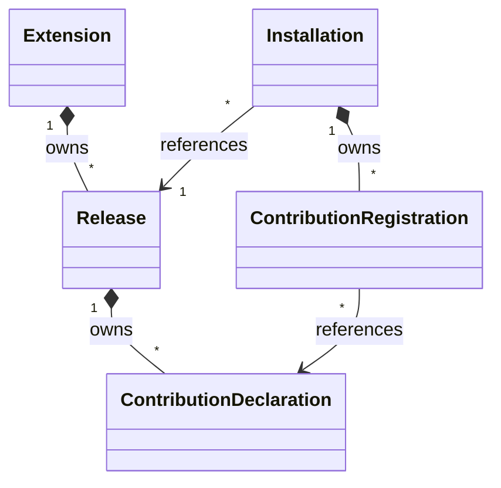

# Extension control model

The [ESS domain](../ess/domains/extensions.yaml) declares five control records and five explicit
relations. The [component](../ess/components/extensions.yaml) owns that domain.

## Ownership and cardinality

| Source | Relation | Target | Cardinality from source | Carrier |
|---|---|---|---|---|
| Extension | owns releases | Release | many | Release.extension_id |
| Release | owns contributions | ContributionDeclaration | many | ContributionDeclaration.release_id |
| Installation | references release | Release | one | Installation.release_id |
| Installation | owns registrations | ContributionRegistration | many | ContributionRegistration.installation_id |
| ContributionRegistration | references declaration | ContributionDeclaration | one | ContributionRegistration.contribution_id |

A release belongs to an extension independently of any installation. Multiple installations may
reference the same release. Removing an installation therefore cannot imply deleting that release.
Registration records belong to an installation; the declaration they reference remains release-owned.

ESS checks the declared targets, carrier types and ownership graph. An `owns` relation expresses
dependent identity; it does not select cascade deletion or permission to destroy data. Removal,
retention and dependency refusal still need command outcomes.

## Structural modeling choices

- Logical identities are distinct opaque String newtypes. This separates an extension, release,
  installation, declaration and registration without assuming UUID allocation or deriving identity
  from a Git repository name.
- Artifact references carry a location and SHA-256 field. This preserves the need for exact
  artifact references; the draft schema does not yet enforce canonical location or digest syntax.
- Contribution categories are Domain, Ui, Connector, Agent, Workflow, Background and Policy.
  Concrete definitions remain in the contracts of their owning runtimes.
- An installation carries a typed tenant reference and a human-facing name. Tenant is a persisted
  fact from verified authentication, not a caller-controlled operation selector.
- Every entity has one terminal `Recorded` state and no commands. This deliberately models
  structural snapshots. `Recorded` means neither enabled nor active; an operational lifecycle
  must arrive together with the commands and events that cause its transitions.

There is no independently owned Tenant, Agent, WorkflowRun, Connection, Grant, credential or
business-data entity here. The control service retains references to foundation-owned resources
through contracts that must still be resolved.

## Unresolved semantics

These `UNMAPPED:` items are present beside the relevant ESS declarations. Their resolution is
required before implementation work that relies on them.

| Item | What must settle it |
|---|---|
| Identifier allocation and canonical spelling | Public API identity contract; no repository-name or realm-derived shortcut |
| Artifact integrity and runtime compatibility | Typed location/digest rules and admission against supported runtime capabilities |
| External tenant relation | Identity's public reference contract and tenant-retirement consequences |
| Configuration | Ownership, release-specific schema, validation, preservation on upgrade and editable-setting paths |
| Policy and count membership | Scoped limits, preinstallation, independent locks, pending/failed/disabled/removed membership and concurrent reservations |
| Resource bindings | Typed foundation/installation target selection, compatibility and caller authority |
| Registration consistency | A command must enforce that a declaration belongs to the installation's selected release |
| Runtime resource references | Owner contracts must establish cardinality and distinguish control references from resource ownership |
| Activation and recovery | Durable progress, stable retry identities, readiness, partial registration, compensation and causal transitions |
| Upgrade, removal and retention | Provenance, configuration preservation, dependency refusal and separate data destruction |

The compiler's structural validation does not enforce cross-record release consistency, tenant
name uniqueness, resource authorization, quota concurrency or runtime readiness. Generated schemas
are projections of this structural subset. No passing structural check is evidence that the
[operational scenarios](scenarios.md) pass.

## Foundation and host boundaries

ESS owns semantic compilation and projection. Platform SDK supplies authoring contracts, builders,
clients and runtime/host adapters. Extensions coordinates installation and registration.
Foundation services retain their own execution and authoritative state.

Workspace owns project and repository working context; Substrate executes admitted work.
Agent Platform and Workflow own their definitions and runs. Connectors retains provider
authorization, Connections and grants; existing custody integrations hold credential values.
Installation selection supplements authenticated tenant, actor and exact optional realm.

A host places panels and attaches them to application sessions. Moving a Phone panel must preserve
its call session unless that extension explicitly declares different behavior. Domain services
retain business data independently of panel or installation-control lifetimes.
